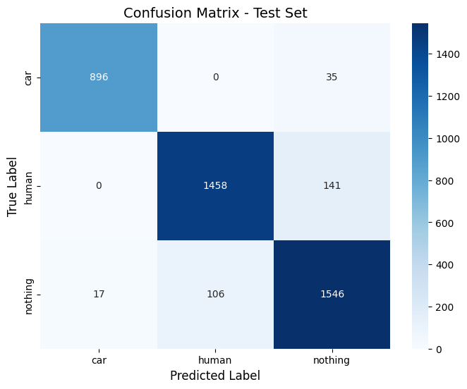

# Geophone Event Classification using PyTorch CNN with Attention

[](https://www.python.org/downloads/)
[](https://pytorch.org/)
[](LICENSE) 
[](https://elbitsystems.com)

---

## 📜 Overview

This project presents an end-to-end pipeline for classifying events (e.g., 'human', 'car', 'nothing') based on time-series data collected from geophone sensors. Utilizing **PyTorch**, the core of the solution is a custom **Convolutional Neural Network (CNN)** enhanced with a **Spatial Attention mechanism**. The pipeline handles raw signal processing, feature extraction via **Log Power Spectrograms**, advanced data augmentation, model training, and evaluation, achieving high classification accuracy even in potentially noisy environments.

---

## ✨ Key Features & Highlights

*   **Custom PyTorch CNN Architecture:** Features multiple convolutional blocks with BatchNorm, ReLU, and MaxPool, tailored for spectrogram analysis.
*   **Spatial Attention Mechanism:** Allows the model to focus on the most informative time-frequency regions within the spectrograms, boosting performance.
*   **Log Power Spectrogram Features:** Transforms raw time-series signals into a rich 2D representation using STFT (`scipy.signal`), suitable for CNNs.
*   **Advanced Data Augmentation:**
    *   Basic time-domain augmentation (noise, shift, scale).
    *   **SpecAugment** applied on-the-fly during training (frequency/time masking, noise, shifts, cutout) via a custom PyTorch Dataset/DataLoader for enhanced robustness.
*   **Intelligent Channel Selection:** Utilizes Cross-Correlation analysis to identify and discard noisy or unreliable sensor channels before feature extraction.
*   **High Classification Accuracy:** Achieved **92.9%** overall accuracy on the held-out test set. *(See Results section for details)*
*   **End-to-End Pipeline:** Covers data loading, robust preprocessing, feature engineering, efficient training loop (with AdamW, LR scheduling, Early Stopping), and detailed evaluation.

---

## 🛠️ Tech Stack

*   **Language:** Python (3.8+)
*   **Core ML Framework:** PyTorch
*   **Signal Processing:** SciPy (`signal` module for STFT, correlation), NumPy
*   **Data Handling:** Pandas
*   **ML Utilities:** Scikit-learn (for `train_test_split`, `LabelEncoder`, `classification_report`, `confusion_matrix`)
*   **Visualization:** Matplotlib, Seaborn
*   **Environment:** Jupyter Notebooks (likely used for experimentation/analysis)

---

## 📊 Pipeline Workflow

1.  **Data Loading & Organization:** Loading raw signal CSVs, handling exceptions (corrupted files), parsing labels from filenames.
2.  **Channel Quality Analysis:** Performing Cross-Correlation between channels (especially vs. 'nothing' signals) and variance analysis to identify and select reliable sensor channels.
3.  **Signal Windowing & Augmentation (Time-Domain):** Segmenting signals into overlapping windows and applying basic time-domain augmentations.
4.  **Feature Engineering (Spectrograms):** Generating Log Power Spectrograms for each window using STFT.
5.  **Data Preparation (PyTorch):**
    *   Label Encoding.
    *   Reshaping spectrograms for CNN input (B, C, H, W).
    *   Splitting into stratified Train/Validation/Test sets.
    *   Creating custom `Dataset` & `DataLoader` with **on-the-fly SpecAugment** for training batches.
6.  **CNN Model Development:** Defining the custom CNN architecture with Spatial Attention in PyTorch.
7.  **Training & Optimization:**
    *   Using `CrossEntropyLoss` and `AdamW` optimizer.
    *   Implementing `ReduceLROnPlateau` learning rate scheduler.
    *   Implementing `EarlyStopping` based on validation accuracy.
    *   Training loop with validation checks.
8.  **Evaluation:** Assessing the best model on the Test set using Accuracy, Precision, Recall, F1-score (`classification_report`), and Confusion Matrix.
9.  **Visualization:** Plotting training curves and the confusion matrix.

---

## 📈 Results & Performance

*   **Overall Test Accuracy:** **92.88%**
*   **Class-wise Performance (Test Set):**

    ```
                  precision    recall  f1-score   support

             car       0.98      0.96      0.97       931
           human       0.93      0.91      0.92      1599
         nothing       0.90      0.93      0.91      1669

        accuracy                           0.93      4199
       macro avg       0.94      0.93      0.94      4199
    weighted avg       0.93      0.93      0.93      4199
    ```

*   **Confusion Matrix (Test Set):**

     


---

<p align="center">
  <i>Leveraging Deep Learning and Signal Processing for Accurate Geophone Event Classification.</i>
</p>
